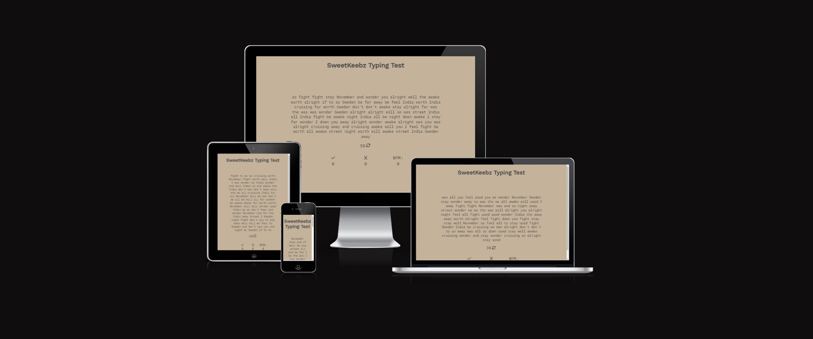
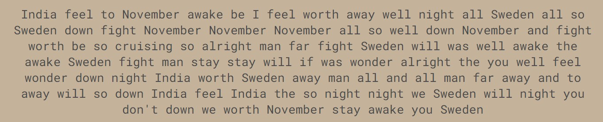

# SweetKeebz Typing Test

This website, as the name suggests, is a typing test. It measures how many words per minute (WPM) you type. It also tracks the number of keystrokes that are correct aswell as the number of keystrokes which are incorrect. This website is perfect for anyone who would like to polish up their touchtyping skills or for anyone who just wants to stimulate their hands. 

## Features

### Typing area

The first thing you will see on the page is the large paragraph of 100 randomly selected words that pops up at the center of the screen. When you type the words out, the characters you type changes color bisque if they are correct and red underlined if they are incorrect.

### Timer and restart

Below the paragraph, you can see the number 30 aswell as a circular arrow. The number 30 is a timer that counts down to 0 as soon as you begin typing. As soon as the timer reaches 0, the user will be unable to type and the final result of the test will be displayed below. The circular arrow is a restart button. It is clickable or you could press alt + tab in order to restart. When restarted, the page will load a new paragraph of text and the timer will wait for you to begin typing again.

### Results

Below the timer and restart section, you can see three symbols. First to the left is a check mark and represents the number of correct keystrokes that you entered. In the middle is an x symbol. This represents the amount of incorrect keystrokes that you have entered. To the far right, it says WPM, this stands for words per minute. This measures how fast you type. It does this by taking your number of correct keystrokes and dividing it by 5 and normalizing the result to a minute (since the test is 30s).

## Testing

